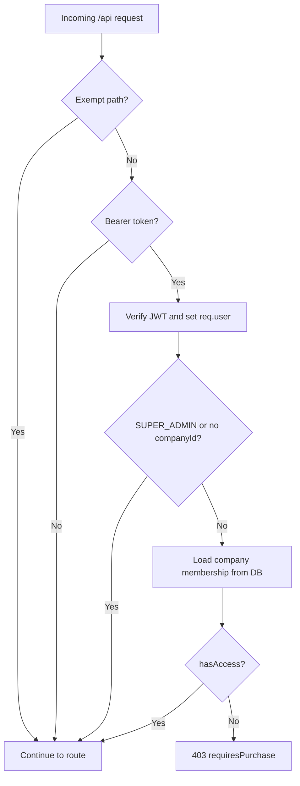

# Membership middleware

Global middleware that enforces **active trial or paid membership** for company users on almost every `/api` request.

Implementation:

| File | Role |
| ---- | ---- |
| `src/middleware/requireMembership.js` | Middleware — mounted on the root API router |
| `src/utils/membershipAccess.js` | Shared access rules (`getMembershipAccess`) |
| `src/routes/index.js` | Registers `requireMembership` before all route modules |
| `src/middleware/authenticateUser.js` | Reuses `req.user` when the membership middleware already parsed the JWT |

Company membership status endpoints: [MEMBERSHIP_USER_API.md](./MEMBERSHIP_USER_API.md).

---

## Request flow



1. **`requireMembership`** runs first on the root router (`src/routes/index.js`).
2. If the path is **exempt**, the request continues without a membership check.
3. If there is **no** `Authorization: Bearer` header, the request continues (public routes and route-level auth are unchanged).
4. If a token is present, it is verified and attached to **`req.user`** (same shape as `authenticateUser`).
5. **`SUPER_ADMIN`** users and users **without** `companyId` skip the check entirely.
6. For all other company users, membership is read from the **database** (not JWT claims — those can be stale after login).
7. If access is denied, the middleware responds with **`403`** and does not call the route handler.

---

## Who is checked

| Caller | Membership check |
| ------ | ---------------- |
| `SUPER_ADMIN` | **Skipped** — full platform access |
| User with no `companyId` | **Skipped** |
| Company user (`ADMIN`, `SUBADMIN`, `MANAGER`, etc.) | **Required** — active `TRIAL` or `ACTIVE` period |
| Unauthenticated request | **Skipped** at this layer (individual routes may still require auth) |

---

## Access rules

Logic lives in `getMembershipAccess()` (`src/utils/membershipAccess.js`). The same helper is used by `GET /api/membership/me/status`.

| Condition | `hasAccess` |
| --------- | ----------- |
| `membership === TRIAL` and `membershipEndDate` is in the future | `true` |
| `membership === ACTIVE` and `membershipEndDate` is in the future | `true` |
| `TRIAL_EXPIRED`, `EXPIRED`, past end date, or missing end date | `false` |

Returned flags:

| Flag | Meaning |
| ---- | ------- |
| `hasAccess` | User may use protected APIs |
| `isInTrial` | Active trial window |
| `requiresPurchase` | `!hasAccess` — show paywall / upgrade UI |

---

## Denied response

When a company user lacks access, the middleware returns **`403`** (not `401`):

```json
{
  "status": "error",
  "message": "Active membership or trial required",
  "membershipStatus": "TRIAL_EXPIRED",
  "requiresPurchase": true
}
```

| Field | Description |
| ----- | ----------- |
| `membershipStatus` | Current `Company.membership` value |
| `requiresPurchase` | Always `true` on this response — use for paywall routing |

Other errors from this middleware:

| Status | When |
| ------ | ---- |
| `401` | Bearer token present but invalid or expired |
| `404` | Token `companyId` does not match a company row |

---

## Exempt paths

These routes are **not** blocked when membership is expired. Paths are relative to `/api` (Express `req.path` on the root router).

### Prefix exemptions

| Prefix | Reason |
| ------ | ------ |
| `/auth` | Login, profile, password reset |
| `/membership-plans` | Public pricing catalog (GET) and super-admin plan CRUD |
| `/company/verification/` | Email / phone OTP during onboarding |

### Exact path exemptions

| Path | Reason |
| ---- | ------ |
| `POST /company/registerCompany` | New company signup |
| `GET /membership/me/status` | Paywall / dashboard membership state |
| `POST /membership/me/start-trial` | Start or acknowledge trial |
| `POST /coupons/verify` | Validate coupon before purchase |
| `GET /company/me/verification-status` | Onboarding verification status |
| `POST /company/kyc/submit` | KYC document upload |

All other `/api` routes (products, invoices, inventory, branches, etc.) require **`hasAccess === true`** for company users.

To allow a new route without membership, add its path to `EXEMPT_EXACT_PATHS` or `EXEMPT_PREFIXES` in `src/middleware/requireMembership.js`.

---

## Interaction with `authenticateUser`

Route handlers that use `authenticateUser` still work as before. If `requireMembership` already verified the JWT and set **`req.user`**, `authenticateUser` skips a second verification:

```javascript
if (req.user) {
  return next();
}
```

Order on a typical protected route:

1. `requireMembership` (global) — membership gate + optional JWT parse
2. `authenticateUser` (per route) — ensures auth when no token was sent on non-exempt paths
3. Controller

---

## Frontend guidance

1. On app load, call **`GET /api/membership/me/status`** for paywall UI (see [MEMBERSHIP_USER_API.md](./MEMBERSHIP_USER_API.md)).
2. If any API returns **`403`** with **`requiresPurchase: true`**, redirect to upgrade / trial flow.
3. Do **not** rely on JWT `membership` alone after login — the middleware always checks the database.
4. **`SUPER_ADMIN`** clients never receive membership blocks from this middleware.

Example trial / upgrade flow when blocked:

1. `GET /api/membership/me/status` → `requiresPurchase: true`
2. `POST /api/membership/me/start-trial` (if eligible) **or** purchase flow via `/membership-plans` + `/coupons/verify`

---

## Related docs

- Company membership API: [MEMBERSHIP_USER_API.md](./MEMBERSHIP_USER_API.md)
- Super-admin plans & demo trial: [MEMBERSHIP_SUPER_ADMIN_API.md](./MEMBERSHIP_SUPER_ADMIN_API.md)
- Auth and route index: [API.md](./API.md)
- Coupon verify (exempt): [COUPONS_API.md](./COUPONS_API.md)
