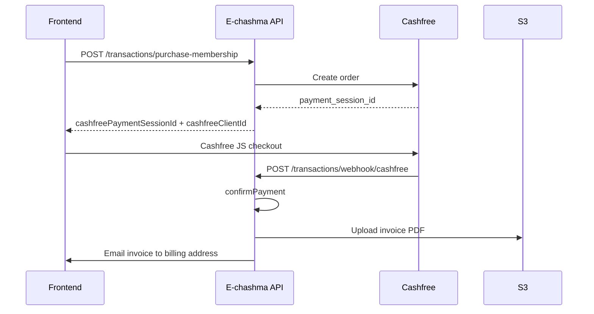

# Membership Transactions API

Company users purchase membership plans online via **Cashfree**. Transactions are stored in **`MembershipTransaction`**; on successful payment the company’s membership is activated and a PDF invoice is generated and emailed.

Implementation: `src/controllers/transaction.controller.js`, `src/routes/transaction.routes.js`, `src/schema/transaction.js`.

**Base URL:** `http://localhost:3001/api` (or your deployed host + `/api`).

Related: [MEMBERSHIP_USER_API.md](./MEMBERSHIP_USER_API.md), [MEMBERSHIP_MIDDLEWARE.md](./MEMBERSHIP_MIDDLEWARE.md), [COUPONS_API.md](./COUPONS_API.md), public plans at `GET /api/membership-plans`.

---

## Authentication

Most routes require a JWT:

```http
Authorization: Bearer <token>
```

Obtain a token from **`POST /api/auth/login`**.

| Route | Auth |
| ----- | ---- |
| `POST /transactions/purchase-membership` | JWT + `companyId` |
| `GET /transactions` | JWT + `companyId` |
| `GET /transactions/:id` | JWT + `companyId` |
| `GET /transactions/:id/invoice` | JWT + `companyId` |
| `POST /transactions/webhook/cashfree` | **Public** (Cashfree server) |

### Company ID requirement

Authenticated transaction routes read **`companyId`** from the JWT. Users without a company receive:

**`400`**

```json
{
  "status": "error",
  "message": "Validation failed",
  "errors": {
    "authorization": ["Company ID is missing from token"]
  }
}
```

### Membership middleware

All `/transactions/*` paths are **exempt** from `requireMembership`, so companies with an **expired** trial or membership can still purchase. See [MEMBERSHIP_MIDDLEWARE.md](./MEMBERSHIP_MIDDLEWARE.md).

The Cashfree webhook is mounted in `src/server.js` **before** `express.json()` so the raw body is available for signature verification.

---

## Enums and constants

| Name | Values |
| ---- | ------ |
| `billingPeriod` | `monthly`, `threeMonth`, `sixMonth`, `annual` |
| `paymentMethod` | `online`, `offline` |
| `onlineGateway` | `cashfree` (only supported gateway) |
| `transactionStatus` | `PENDING`, `SUCCESS`, `FAILED`, `CANCELLED`, `REFUNDED` |

Source: `src/utils/membershipTransactionConstants.js`.

---

## Routes overview

| Method | Path | Description |
| ------ | ---- | ----------- |
| POST | `/transactions/purchase-membership` | Start a membership purchase (Cashfree checkout) |
| GET | `/transactions` | List transactions for the token’s company |
| GET | `/transactions/payment-status/:tx` | Poll payment success/failure after checkout |
| GET | `/transactions/:id` | Get one transaction |
| GET | `/transactions/:id/invoice` | Download invoice PDF |
| POST | `/transactions/webhook/cashfree` | Cashfree payment webhook (public) |

---

## Purchase flow (Cashfree)



---

## `POST /api/transactions/purchase-membership`

Creates a pending transaction and (for online Cashfree) a Cashfree order. Use the returned **`cashfreePaymentSessionId`** and **`cashfreeClientId`** with the [Cashfree Web Checkout / JS SDK](https://www.cashfree.com/docs).

### Request

**Content-Type:** `application/json`

| Field | Type | Required | Notes |
| ----- | ---- | -------- | ----- |
| `membershipId` | number | Yes | `MembershipPlan.id` |
| `billingPeriod` | string | Yes | See enums above |
| `billingAddress` | object | Yes | See billing address table |
| `billingAddressSameAsInstitute` | boolean | Yes | If `false`, saved to `Company.billingAddressJson` |
| `paymentMethod` | string | Yes | `online` or `offline` |
| `onlineGateway` | string | Yes when `online` | Must be `cashfree` |
| `priceBreakdown` | object | Yes | Must match server-calculated pricing |
| `couponCode` | string | No | Applied only if valid; invalid codes are ignored |
| `successUrl` | string | No | May contain `{transaction_id}` placeholder |
| `failureUrl` | string | No | May contain `{transaction_id}` placeholder |
| `chequeDetails` | object | No | Reserved for offline flow |

#### `billingAddress`

| Field | Type | Max length |
| ----- | ---- | ---------- |
| `fullName` | string | 200 |
| `email` | string (email) | 100 |
| `phone` | string | 15 (10+ digits for Cashfree) |
| `address` | string | 500 |
| `city` | string | 100 |
| `state` | string | 100 |
| `pincode` | string | 10 |
| `country` | string | 100 |

#### `priceBreakdown`

| Field | Type | Description |
| ----- | ---- | ----------- |
| `basePrice` | number | Plan price for the billing period (no late-renewal fine) |
| `couponDiscount` | number | Discount amount |
| `subtotal` | number | `basePrice - couponDiscount` |
| `gstAmount` | number | GST on subtotal |
| `totalAmount` | number | Amount charged via Cashfree |

The server validates `basePrice` against the plan’s list price (± ₹0.01). If a valid `couponCode` is sent, the server recalculates discount, GST, and total.

### Example request

```json
{
  "membershipId": 1,
  "billingPeriod": "annual",
  "billingAddress": {
    "fullName": "John Doe",
    "email": "john@example.com",
    "phone": "9876543210",
    "address": "123 Main Street",
    "city": "Mumbai",
    "state": "Maharashtra",
    "pincode": "400001",
    "country": "India"
  },
  "billingAddressSameAsInstitute": true,
  "paymentMethod": "online",
  "onlineGateway": "cashfree",
  "couponCode": "SAVE10",
  "successUrl": "https://echashma.in/payment/success?tx={transaction_id}",
  "failureUrl": "https://echashma.in/payment/failed?tx={transaction_id}",
  "priceBreakdown": {
    "basePrice": 9999,
    "couponDiscount": 500,
    "subtotal": 9499,
    "gstAmount": 1709.82,
    "totalAmount": 11208.82
  }
}
```

### Success: `201`

```json
{
  "transactionId": 42,
  "membershipPlan": {
    "id": 1,
    "name": "Professional"
  },
  "billingPeriod": "annual",
  "priceBreakdown": {
    "basePrice": 9999,
    "couponDiscount": 500,
    "subtotal": 9499,
    "gstAmount": 1709.82,
    "totalAmount": 11208.82
  },
  "couponCode": "SAVE10",
  "transactionStatus": "PENDING",
  "paymentGateway": "cashfree",
  "cashfreeOrderId": "ech_a1b2c3d4...",
  "cashfreePaymentSessionId": "session_...",
  "cashfreeClientId": "TEST1096260...",
  "subscriptionStartDate": "2026-06-08T12:00:00.000Z",
  "subscriptionEndDate": "2027-06-08T12:00:00.000Z",
  "nextBillingDate": "2027-06-08T12:00:00.000Z",
  "successUrl": "https://echashma.in/payment/success?tx=42",
  "failureUrl": "https://echashma.in/payment/failed?tx=42"
}
```

| Field | Description |
| ----- | ----------- |
| `cashfreePaymentSessionId` | Pass to Cashfree checkout SDK |
| `cashfreeClientId` | Cashfree app id for frontend SDK |
| `cashfreeOrderId` | Merchant order id sent to Cashfree |
| `transactionStatus` | `PENDING` until webhook confirms payment |

If Cashfree order creation fails, status is `FAILED` and `failureReason` is included; a failure email is sent.

### Business rules

- Plan must exist and have `status: ACTIVE`.
- Cannot repurchase the **same plan + same billing period** while membership is still active (not expired).
- **No late-renewal fine** — `basePrice` is always the plan list price.
- **Online:** only **Cashfree** is supported.
- **Offline:** transaction stays `PENDING` (manual confirmation not implemented yet).

### Errors

| Status | When |
| ------ | ---- |
| `400` | Validation failed, price mismatch, duplicate active purchase, unsupported gateway |
| `401` | Missing / invalid token |
| `404` | Plan or company not found |
| `500` | Cashfree not configured, unexpected server error |

---

## `GET /api/transactions`

Paginated list for the authenticated company.

### Query parameters

| Param | Default | Max |
| ----- | ------- | --- |
| `page` | `1` | — |
| `limit` | `10` | `50` |

### Success: `200`

```json
{
  "data": [
    {
      "id": 42,
      "uuid": "...",
      "membershipPlanId": 1,
      "companyId": 12,
      "billingPeriod": "annual",
      "billingAddress": { "fullName": "...", "email": "..." },
      "billingAddressSameAsCompany": true,
      "paymentGateway": "cashfree",
      "paymentMethod": "online",
      "priceBreakdown": {
        "basePrice": 9999,
        "couponDiscount": 0,
        "subtotal": 9999,
        "gstAmount": 1799.82,
        "totalAmount": 11798.82
      },
      "couponCode": null,
      "transactionStatus": "SUCCESS",
      "cashfreeOrderId": "ech_...",
      "cashfreePaymentSessionId": "session_...",
      "cashfreePaymentId": "123456",
      "subscriptionStartDate": "...",
      "subscriptionEndDate": "...",
      "invoicePdfUrl": "https://...",
      "invoiceUrl": "https://...",
      "createdAt": "...",
      "updatedAt": "...",
      "membershipPlan": {
        "id": 1,
        "name": "Professional",
        "description": "..."
      }
    }
  ],
  "pagination": {
    "total": 1,
    "page": 1,
    "limit": 10,
    "totalPages": 1
  }
}
```

---

## `GET /api/transactions/payment-status/:tx`

Poll payment result after Cashfree checkout redirect. Use the `tx` query param from your success/failure URL (UUID or numeric transaction id).

If the transaction is still `PENDING`, the server checks Cashfree order/payment status and updates the transaction before responding (useful when webhooks are delayed or unavailable locally).

### Path parameter

| Value | Example |
| ----- | ------- |
| Transaction UUID | `5ea8cf06-fd33-4134-8016-98d528284199` |
| Numeric transaction id | `1003` |
| Cashfree merchant order id | `ech_7c9e61814ab24b3dbe379b3a2a5f83c5` |

### Success: `200`

```json
{
  "transactionId": 1003,
  "transactionUuid": "5ea8cf06-fd33-4134-8016-98d528284199",
  "transactionStatus": "SUCCESS",
  "completed": true,
  "success": true,
  "failed": false,
  "pending": false,
  "membershipPlan": { "id": 3, "name": "Enterprise" },
  "billingPeriod": "threeMonth",
  "priceBreakdown": {
    "basePrice": 6999,
    "couponDiscount": 500,
    "subtotal": 6499,
    "gstAmount": 1169.82,
    "totalAmount": 7668.82
  },
  "couponCode": "ECHASHMA500",
  "failureReason": null,
  "cashfreeOrderId": "ech_7c9e61814ab24b3dbe379b3a2a5f83c5",
  "invoicePdfUrl": "https://echashma-bucket.s3.ap-south-1.amazonaws.com/invoices/12/Invoice-ECH-00001003.pdf",
  "invoiceUrl": "https://echashma-bucket.s3.ap-south-1.amazonaws.com/invoices/12/Invoice-ECH-00001003.pdf",
  "subscriptionStartDate": "2026-06-08T17:15:32.535Z",
  "subscriptionEndDate": "2026-09-08T17:15:32.535Z",
  "nextBillingDate": "2026-09-08T17:15:32.535Z"
}
```

| Field | Description |
| ----- | ----------- |
| `completed` | `true` when status is `SUCCESS` or `FAILED` |
| `success` | `true` only when payment succeeded |
| `failed` | `true` when payment failed or was cancelled |
| `pending` | `true` while still waiting for payment confirmation |

### Frontend polling example

```text
GET /api/transactions/payment-status/5ea8cf06-fd33-4134-8016-98d528284199
Authorization: Bearer <token>
```

Poll every 2–3 seconds until `completed` is `true`, then show success or failure UI.

### Errors

| Status | When |
| ------ | ---- |
| `400` | Invalid `tx` reference or missing `companyId` |
| `404` | Transaction not found for this company |

---

## `GET /api/transactions/:id`

Returns one transaction scoped to the JWT’s `companyId`. Includes `membershipPlan` and `company` summary on detail fetch.

### Errors

| Status | When |
| ------ | ---- |
| `400` | Invalid id or missing `companyId` |
| `404` | Transaction not found for this company |

---

## `GET /api/transactions/:id/invoice`

Downloads the membership invoice PDF.

| Case | Behavior |
| ---- | -------- |
| `invoicePdfUrl` set | `302` redirect to S3 URL |
| No stored URL | Generates PDF on the fly via Puppeteer |

**Response headers (on-the-fly):**

```http
Content-Type: application/pdf
Content-Disposition: attachment; filename="Invoice-ECH-00000042.pdf"
```

---

## `POST /api/transactions/webhook/cashfree`

Public endpoint for Cashfree PG webhooks. Processed **synchronously** (no queue).

**Configure in Cashfree dashboard:**

```text
https://<your-host>/api/transactions/webhook/cashfree
```

Or set `PUBLIC_API_BASE_URL` in `.env` — the purchase flow sends this as `order_meta.notify_url`.

### Headers (from Cashfree)

| Header | Purpose |
| ------ | ------- |
| `x-webhook-signature` | HMAC signature |
| `x-webhook-timestamp` | Signature timestamp |

Signature is verified against the **raw request body** (`src/middleware/cashfreeWebhookRawBody.js`).

### Handled events

| Event | Action |
| ----- | ------ |
| `PAYMENT_SUCCESS_WEBHOOK` | Mark transaction `SUCCESS`, activate company membership, apply coupon, generate PDF invoice, email customer |
| `PAYMENT_FAILED_WEBHOOK` | Mark `FAILED`, send failure email |
| `PAYMENT_USER_DROPPED_WEBHOOK` | Mark `FAILED` (user abandoned checkout) |

### Success: `200`

```json
{
  "received": true,
  "processed": true,
  "type": "PAYMENT_SUCCESS_WEBHOOK",
  "orderId": "ech_a1b2c3d4...",
  "signatureValid": true
}
```

Always returns **`200`** on receipt (even on processing errors) to avoid unnecessary Cashfree retries. Webhook payloads are appended to `logs/webhooks/cashfree-logs/`.

### On payment success

Updates **`Company`**:

| Field | Value |
| ----- | ----- |
| `membership` | `ACTIVE` |
| `membershipPlanId` | purchased plan id |
| `membershipName` | plan name |
| `membershipStartDate` | transaction subscription start |
| `membershipEndDate` | transaction subscription end |

---

## Environment variables

| Variable | Required | Description |
| -------- | -------- | ----------- |
| `CASHFREE_CLIENT_ID` | Yes (online) | Cashfree app id |
| `CASHFREE_CLIENT_SECRET` | Yes (online) | API secret + webhook HMAC key |
| `CASHFREE_ENV` | No | `sandbox` (default) or `production` |
| `PUBLIC_API_BASE_URL` | Recommended | Public backend URL for webhook `notify_url` |
| `FRONTEND_URL` | No | Fallback return URL if `successUrl` omitted |
| `EMAIL_USER` / `EMAIL_PASS` | No | Invoice / failure emails (skipped if unset) |
| `AWS_*` | No | S3 upload for invoice PDFs |
| `PUPPETEER_EXECUTABLE_PATH` | No | Override Chrome/Chromium path on Linux servers |

---

## Frontend Cashfree checkout (summary)

After `POST /transactions/purchase-membership` with `transactionStatus: PENDING`:

1. Load Cashfree SDK with `cashfreeClientId`.
2. Open checkout with `cashfreePaymentSessionId`.
3. Poll `GET /transactions/payment-status/:tx` until `completed` is `true` (preferred), or use `GET /transactions/:id`.

Placeholders in URLs:

- `{transaction_id}` → replaced with numeric transaction id in the purchase response.

---

## Related docs

- Membership status / trial: [MEMBERSHIP_USER_API.md](./MEMBERSHIP_USER_API.md)
- Coupon verification before checkout: [COUPONS_API.md](./COUPONS_API.md) — `POST /api/coupons/verify`
- Paywall middleware: [MEMBERSHIP_MIDDLEWARE.md](./MEMBERSHIP_MIDDLEWARE.md)
