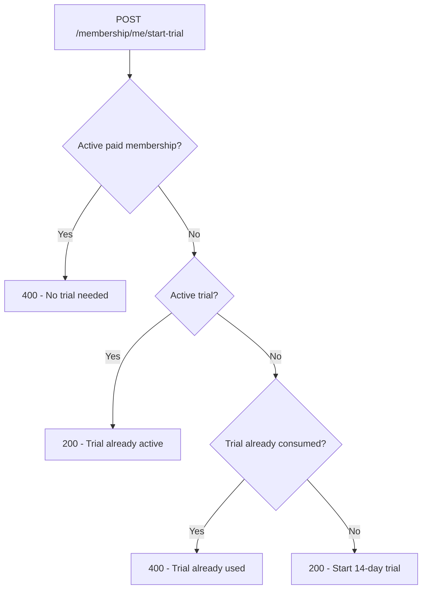

# Membership trial — one-time 14-day rule

Each company gets **one** self-service 14-day trial. After it is used or expires, the company must **purchase a membership** — they cannot call `POST /api/membership/me/start-trial` again.

Implementation:

| File | Role |
| ---- | ---- |
| `src/utils/membershipAccess.js` | `hasConsumedTrial()` — detects used trial |
| `src/utils/membershipDates.js` | `MEMBERSHIP_TRIAL_DAYS = 14`, date helpers |
| `src/controllers/membership.controller.js` | `startTrial` endpoint rules |
| `src/controllers/companies.controller.js` | `registerCompany` — grants initial trial |

API endpoints: [MEMBERSHIP_USER_API.md](./MEMBERSHIP_USER_API.md).  
Global access gate: [MEMBERSHIP_MIDDLEWARE.md](./MEMBERSHIP_MIDDLEWARE.md).

---

## How companies get a trial

| Source | When | Duration |
| ------ | ---- | -------- |
| **`POST /api/company/registerCompany`** | Public signup | 14 days (automatic) |
| **`POST /api/membership/me/start-trial`** | Logged-in company user | 14 days (only if trial never consumed) |
| **`POST /api/membership-plans/demo-trial`** | **SUPER_ADMIN** only | Custom days (not limited by this rule) |

Most companies receive their trial at **registration**. The `start-trial` route is mainly for edge cases where a company exists without an active trial window, or to idempotently confirm an already-active trial.

---

## One-time rule

A company **cannot** start a new self-service trial when any of the following is true:

| `Company.membership` | `membershipEndDate` | Trial consumed? |
| -------------------- | ------------------- | --------------- |
| `TRIAL` | In the future | **No** — trial still active |
| `TRIAL` | In the past | **Yes** — registration or prior trial ended |
| `TRIAL_EXPIRED` | Any | **Yes** |
| `EXPIRED` | Any | **Yes** |
| `ACTIVE` | Future or past | **Yes** — paid customers cannot self-start a trial |

Logic is implemented in **`hasConsumedTrial(company)`** (`src/utils/membershipAccess.js`).

---

## `POST /api/membership/me/start-trial` decision flow



### Outcomes

| Case | HTTP | Message / body |
| ---- | ---- | -------------- |
| Active paid membership | `400` | `You already have an active membership. No trial needed.` |
| Active trial (not expired) | `200` | `Trial already active` + `trialEndsAt` (idempotent; does **not** extend trial) |
| Trial already used | `400` | `You have already used your 14-day trial. Please purchase a membership to continue.` |
| First self-service trial | `200` | `14-day trial started successfully` + new dates |

### Blocked response example

**`400`**

```json
{
  "status": "error",
  "message": "You have already used your 14-day trial. Please purchase a membership to continue."
}
```

---

## Typical lifecycle

### 1. Registration (automatic trial)

`POST /api/company/registerCompany` sets:

- `membership` → `TRIAL`
- `membershipStartDate` → now
- `membershipEndDate` → now + 14 days

The company has **`hasAccess: true`** during this window (see [MEMBERSHIP_MIDDLEWARE.md](./MEMBERSHIP_MIDDLEWARE.md)).

### 2. Trial still active

- `GET /api/membership/me/status` → `isInTrial: true`, `requiresPurchase: false`
- Optional: `POST /api/membership/me/start-trial` → `200` “Trial already active” (no extension)

### 3. Trial expired

- `membership` may remain `TRIAL` with a past `membershipEndDate`, or become `TRIAL_EXPIRED` / `EXPIRED`
- `GET /api/membership/me/status` → `requiresPurchase: true`
- Protected APIs return **`403`** from `requireMembership` (except exempt paywall/onboarding routes)
- `POST /api/membership/me/start-trial` → **`400`** trial already used

### 4. After purchase

- `membership` → `ACTIVE` with a future `membershipEndDate`
- Self-service trial is permanently unavailable for that company (`hasConsumedTrial` is `true` for any `ACTIVE` status)

---

## Super-admin exception

**SUPER_ADMIN** can grant additional trial time via:

**`POST /api/membership-plans/demo-trial`**

This bypasses the one-time self-service rule. See [MEMBERSHIP_SUPER_ADMIN_API.md](./MEMBERSHIP_SUPER_ADMIN_API.md).

---

## Frontend guidance

1. On signup, assume the **registration trial** is already started — no need to call `start-trial` immediately.
2. Use **`GET /api/membership/me/status`** for paywall state, not JWT `membership` alone.
3. If `POST /api/membership/me/start-trial` returns the **“already used”** message, route the user to **pricing / checkout** (`GET /api/membership-plans`, `POST /api/coupons/verify`).
4. Do not retry `start-trial` after a `400` “already used” — it will not succeed without a super-admin demo trial or paid upgrade.

---

## Related docs

- Company membership API: [MEMBERSHIP_USER_API.md](./MEMBERSHIP_USER_API.md)
- Global membership middleware: [MEMBERSHIP_MIDDLEWARE.md](./MEMBERSHIP_MIDDLEWARE.md)
- Super-admin demo trial: [MEMBERSHIP_SUPER_ADMIN_API.md](./MEMBERSHIP_SUPER_ADMIN_API.md)
- Company registration: [API.md](./API.md)
